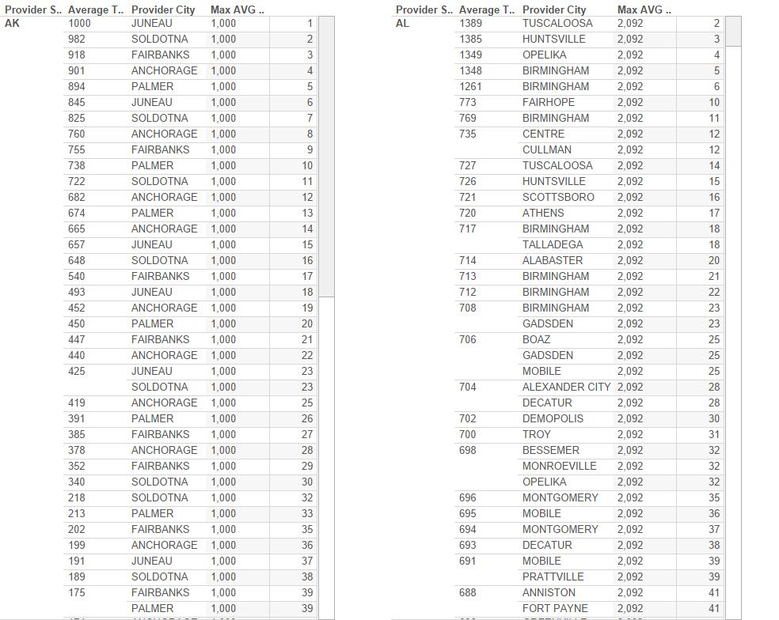
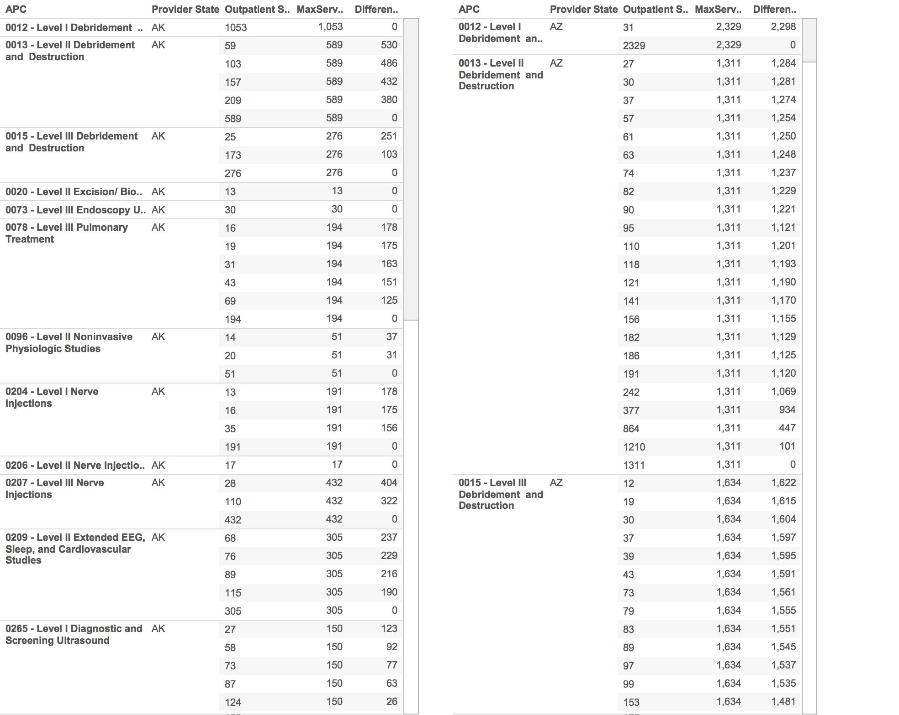
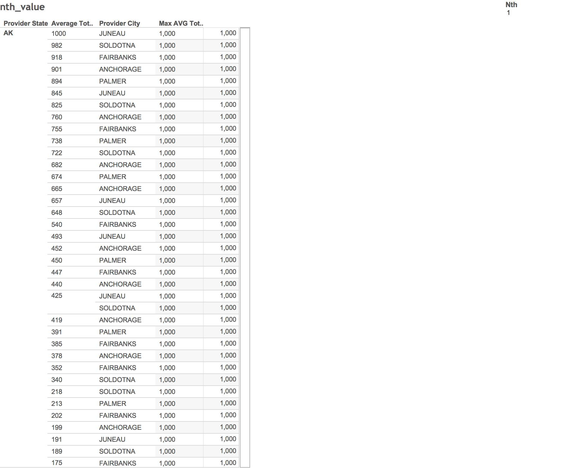
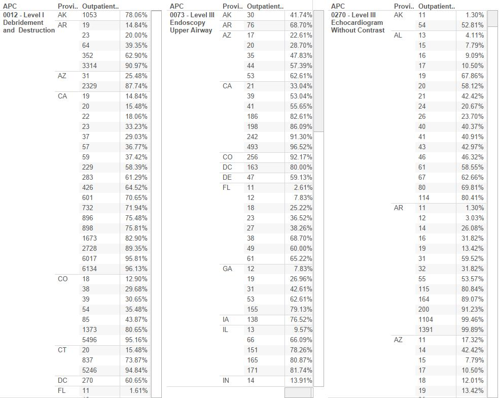

```{r setup, include=FALSE}
knitr::opts_chunk$set(cache=FALSE)
```

__1. Loading of R packages: RCurl, ggplot2, extrafont, jsonlite, dplyr, tidyr, extrafont, jsonlite, reshape2 (R code not shown)__

```{r, include=FALSE}
library(RCurl)
library (ggplot2)
library(extrafont)
library(reshape2)
require(jsonlite)
require(dplyr)
require(tidyr)
require(reshape2)
```
__2. Data__
Data that is provided for Project2 was selected from the Centers for Medicare and Medicaid Services (CMS). This center provides information about all health care services in America. In this project, Jeffrey and Jackie are focusing on Medicare Providers and the medical charges for outpatient services in 2012. 

The data set can be found at [Medicare Provider Utilization and Payment Data: Outpatient](http://www.cms.gov/Research-Statistics-Data-and-Systems/Statistics-Trends-and-Reports/Medicare-Provider-Charge-Data/Outpatient.html)

```{r}
source("../03 Data/df.R",echo = T)
tbl_df(df)
```
__3. Crosstabss created through SQL query in R__
From this rank crosstab, we can clearly see the rank of a specific medicial payment(on AVG) in each state. For example, a $738 medical payment is on the 10th rank in AK state. Therefore, this crosstab is very useful for us to visulize the rank for a specific medical payment in each state.

```{r}
source("../01 SQL crosstabs/rank.R", echo=T)
```


```{r}
source("../01 SQL crosstabs/last_max_diff.R", echo=T)
```

from this nth_value crosstab, we can clearly see the nth value of the medical payment (on AVG) in each state as we want. For exmaple, if we want to see the fifth value of the medicial payment in each state, we can put 5 in the nth_value parameter. 

```{r}
source("../01 SQL crosstabs/nth_value.R", echo=T)
```

```{r}
source("../01 SQL crosstabs/cumediff.R", echo=T)
```
__4. Crosstabs created through Tableau__






```{r fig.width=7, fig.height=6}
```

